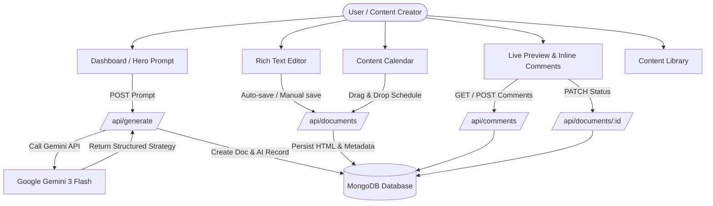

# Butterscribe - System Design Document & Feature Specification

## 1. Executive Summary

**Butterscribe** is an enterprise-grade AI-powered content strategy and publishing platform built with Next.js 16 (App Router), React 19, TypeScript, and MongoDB. The application seamlessly bridges AI-driven content generation, rich text editing, editorial collaboration, content calendar planning, and multi-stage approval workflows into a unified workspace.

---

## 2. Technical Stack & Architecture

### 2.1 Core Technologies
- **Framework**: [Next.js 16.2.6](https://nextjs.org/) (App Router, Server Components & Client Components)
- **UI & View Layer**: [React 19.2.4](https://react.dev/), Tailwind CSS 4, Radix UI primitives, Lucide / Hugeicons icon sets
- **Database & ORM**: MongoDB with [Mongoose 9.6.2](https://mongoosejs.com/)
- **Authentication**: [NextAuth.js 4.24.14](https://next-auth.js.org/) using JWT strategy and custom credentials provider with Bcrypt.js password hashing
- **AI Integration**: [@google/generative-ai 0.24.1](https://www.npmjs.com/package/@google/generative-ai) utilizing Gemini API (`gemini-3-flash-preview`)
- **Rich Text Editor**: [Tiptap Editor 3.23.5](https://tiptap.dev/) with extensions for links, images, highlights, colors, text alignment, and underlines
- **Calendar & Scheduling**: [FullCalendar 6.1.20](https://fullcalendar.io/) (`dayGrid`, `timeGrid`, `interaction` plugins)
- **State Management**: [Zustand 5.0.13](https://zustand-demo.pmnd.rs/) for client-side layout, editor, and keyword states
- **Form Handling & Validation**: [React Hook Form 7.76.0](https://react-hook-form.com/) integrated with [Zod 4.4.3](https://zod.dev/) resolvers
- **Email Service**: Nodemailer 7.0.13 for password resets and notifications
- **Notifications**: Sonner toast notification library

---

## 3. High-Level Architecture & System Data Flow



---

## 4. Database Schema & Data Models

### 4.1 `User` Model ([`src/models/user.ts`](file:///Users/arunbiradar/Developer/Work/butterscribe/src/models/user.ts))
Represents registered users in the platform.
- `name` (*String*, required): User's full name.
- `email` (*String*, required, unique): User's email address.
- `password` (*String*, required): Bcrypt hashed password.
- `role` (*String*, enum: `['user', 'admin', 'manager', 'super user']`, default: `'user'`): Authorization level.
- `isActive` (*Boolean*, default: `true`): Account activation flag.
- `cart` (*ObjectId*, ref: `'Cart'`): Associated cart object.
- `orders` (*Array of ObjectIds*, ref: `'Order'`): Array of user order references.
- `timestamps`: Automatic `createdAt` and `updatedAt`.

### 4.2 `Document` Model ([`src/models/document.ts`](file:///Users/arunbiradar/Developer/Work/butterscribe/src/models/document.ts))
Represents content articles and drafts created or generated in Butterscribe.
- `title` (*String*, required): Document title.
- `description` (*String*): Short document excerpt or summary.
- `body` (*String*, default: `''`): HTML content generated by Tiptap editor.
- `aiGenerationId` (*ObjectId*, ref: `'AiGeneration'`): Reference to associated AI strategy generation.
- `userId` (*ObjectId*, ref: `'User'`, required): Owner ID of the document.
- `status` (*String*, enum: `['draft', 'published', 'archived', 'approved', 'changes_requested']`, default: `'draft'`): Lifecycle state.
- `startDate` (*Date*): Scheduled publication / event start date.
- `endDate` (*Date*): Scheduled publication / event end date.
- `timestamps`: Automatic `createdAt` and `updatedAt`.

### 4.3 `AiGeneration` Model ([`src/models/aiGeneration.ts`](file:///Users/arunbiradar/Developer/Work/butterscribe/src/models/aiGeneration.ts))
Stores raw AI prompt strategies generated via Google Gemini.
- `title` (*String*, required): Truncated title derived from prompt.
- `prompt` (*String*, required): Original user prompt sent to AI.
- `response` (*String*, required): Full Markdown-formatted output generated by Gemini API.
- `userId` (*ObjectId*, ref: `'User'`, required): User who requested the generation.
- `documentId` (*ObjectId*, ref: `'Document'`): Linked document reference.
- `timestamps`: Automatic `createdAt` and `updatedAt`.

### 4.4 `Comment` Model ([`src/models/comment.ts`](file:///Users/arunbiradar/Developer/Work/butterscribe/src/models/comment.ts))
Enables inline textual feedback and 1-level threaded discussion.
- `documentId` (*ObjectId*, ref: `'Document'`, required): Associated document.
- `userId` (*ObjectId*, ref: `'User'`, required): Comment author ID.
- `userName` (*String*, required): Author display name.
- `userAvatar` (*String*): Author avatar image URL.
- `text` (*String*, required): Feedback message text.
- `selection` (*String*): Highlighted text snippet from the document.
- `parentId` (*ObjectId*, ref: `'Comment'`): Parent comment ID for 1-level nested replies.
- `timestamps`: Automatic `createdAt` and `updatedAt`.

---

## 5. Complete Feature Breakdown & Specifications

### 5.1 AI-Powered Strategy Generation
- **Prompt Hero Interface**: Located prominently on the main dashboard ([`src/modules/dashboard/components/HeroPrompt.tsx`](file:///Users/arunbiradar/Developer/Work/butterscribe/src/modules/dashboard/components/HeroPrompt.tsx)).
- **Structured System Prompting**: Sends structured requests to Google Gemini 3 Flash Preview (`gemini-3-flash-preview`) to output:
  1. **Content Outline**: Sequential main headings.
  2. **Keywords**: Categorized into Long Tail (5+), Short Tail (5+), and Question Keywords (5+).
  3. **Follow-up Questions**: Ideas for related content pieces.
- **Automated Document Creation**: Automatically creates a new blank document draft linked to the generated AI strategy record in MongoDB, redirecting the user straight to the editor.

### 5.2 WYSIWYG Rich Text Editor
- **Tiptap Engine Integration**: Custom configured editor supporting rich text controls:
  - Formatting: Bold, Italic, Underline, Strikethrough, Custom Text Colors, Color Highlighting, Headings H1-H6, Alignment (Left, Center, Right).
  - Structure: Bullet Lists, Numbered Lists, Blockquotes, Inline Code.
  - Media & Links: Link modal for insertion and removal, Image modal supporting URL insertion or local file browser upload via Base64 encoding.
- **Paste Authenticity Enforcement**: Intercepts paste events and shows feedback notifying users that copy-paste is disabled to guarantee content originality (configurable via `NEXT_PUBLIC_ALLOW_PASTE`).
- **Autosave Engine**: Periodically checks for content changes every 30 seconds (configurable via `NEXT_PUBLIC_AUTOSAVE_INTERVAL`) and triggers background persistence without blocking user workflow.
- **AI Ghostwriter Strategy Drawer**: Slide-out / modal interface ([`src/app/create-content/(components)/EditorModals.tsx`](file:///Users/arunbiradar/Developer/Work/butterscribe/src/app/create-content/(components)/EditorModals.tsx)) rendering the linked Gemini AI keyword research and outline alongside the live text editor.

### 5.3 Live Preview & Collaborative Review
- **Document Rendering**: Clean reader-focused layout displaying the full article formatted with typography styling ([`src/app/live-preview/[id]/page.tsx`](file:///Users/arunbiradar/Developer/Work/butterscribe/src/app/live-preview/%5Bid%5D/page.tsx)).
- **Inline Text Selection & Floating Commenting**: Users can highlight text anywhere in the document body to trigger a floating comment action.
- **Threaded Comments Sidebar**: Renders inline comments anchored to specific text selections with support for 1-level deep reply threads.
- **Real-Time Content Analytics**: Dynamically parses the document body HTML to compute:
  - Word count & estimated reading time.
  - Heading distribution counts (H1–H6).
  - Internal links count, image count, blockquote count, bold text count, paragraph count.

### 5.4 Document Workflow & Status Lifecycle
- **Status Enum**: `draft` ➔ `changes_requested` ➔ `approved` ➔ `published` / `archived`.
- **Approved State Read-Only Locking**: Once marked as `approved`, the document becomes read-only in the editor with a notice header.
- **Interactive Approval Controls**: Reviewers can click **Approve** or **Request Changes** directly in the Live Preview header or Approvals list.

### 5.5 Content Calendar & Visual Scheduling
- **FullCalendar Integration**: Interactive month/week calendar interface ([`src/app/content-calendar/page.tsx`](file:///Users/arunbiradar/Developer/Work/butterscribe/src/app/content-calendar/page.tsx)).
- **Drag-and-Drop Scheduling**: Sidebar displaying unscheduled drafts. Users drag any draft onto a calendar date cell to schedule it.
- **End Date Popover & Optimistic UI Updates**: Dropping an item opens an End Date selection popover, immediately updating local state before persisting to the database.

### 5.6 Content Library Management
- **Search & Pagination**: Server-side filterable data table ([`src/app/content-library/page.tsx`](file:///Users/arunbiradar/Developer/Work/butterscribe/src/app/content-library/page.tsx)) supporting full-text title search regex and status filtering.
- **URL Parameter State Synchronization**: Search terms, active status filter, page index, and items per page limit are mapped to URL query parameters (`search`, `status`, `page`, `limit`).

### 5.7 Authentication & User Security
- **NextAuth Credentials Strategy**: Custom authentication flow with password hashing using `bcryptjs`.
- **User Account Actions**: Pre-built client handlers for Sign In, Sign Up with auto-login, Forgot Password, and Reset Password via email tokens.

---

## 6. Directory Map & Code Structure

```
butterscribe/
├── src/
│   ├── app/                                 # Next.js App Router Routes & API
│   │   ├── api/                             # Backend API Endpoints
│   │   │   ├── ai-generations/by-document/  # Fetch AI strategy by document ID
│   │   │   ├── auth/[...nextauth]/          # NextAuth authentication config & handler
│   │   │   ├── comments/                    # Inline comments & replies CRUD
│   │   │   ├── documents/                   # Document CRUD, search & pagination
│   │   │   └── generate/                    # Gemini AI generation endpoint
│   │   ├── approvals/                       # Approvals dashboard page
│   │   ├── auth/                            # Authentication pages (signin, signup, etc.)
│   │   ├── content-calendar/                # Calendar view page
│   │   ├── content-library/                 # Document library table page
│   │   ├── create-content/                  # Rich text editor workspace page & components
│   │   ├── dashboard/                       # Main application dashboard
│   │   ├── live-preview/                    # Document live preview page
│   │   ├── globals.css                      # Core design system tokens & styles
│   │   ├── layout.tsx                       # Root layout wrapper
│   │   └── page.tsx                         # Landing / redirect page
│   ├── components/                          # UI & Layout components
│   │   ├── layout/                          # Header, Footer, Sidebar layouts
│   │   ├── shared/                          # Reusable DocumentTable, form fields, logo
│   │   └── ui/                              # Radix UI & Shadcn primitive components
│   ├── context/                             # AuthProvider wrapper
│   ├── lib/                                 # Shared utilities & database core
│   │   ├── actions/                         # Auth form submit handlers
│   │   ├── db/                              # MongoDB connection handler with caching
│   │   └── utils.ts                         # Class merging (clsx + tailwind-merge)
│   ├── models/                              # Mongoose Schemas (User, Document, AiGeneration, Comment)
│   ├── modules/                             # Feature-driven module logic
│   │   ├── calendar/                        # Calendar sidebar, draft modal, end date popover
│   │   ├── dashboard/                       # HeroPrompt, StatsGrid, ContentTable
│   │   ├── editor/                          # Tiptap editor wrapper
│   │   └── keywords/                        # Keyword lists & store
│   ├── schemas/                             # Zod validation schemas
│   ├── store/                               # Zustand stores (layoutStore, editorStore, keywordStore)
│   └── utils/                               # Email sending helpers (Nodemailer)
├── types/                                   # TypeScript global declarations & interfaces
├── scripts/                                 # Environment deployment shell scripts
├── package.json                             # Dependencies & scripts configuration
└── DESIGN_DOCUMENT.md                       # Comprehensive design specification
```

---

## 7. API Reference Summary

| Method | Endpoint | Description | Auth Required |
| :--- | :--- | :--- | :---: |
| `POST` | `/api/generate` | Generates AI strategy via Gemini 3 Flash and initializes draft document | Yes |
| `GET` | `/api/documents` | List user documents with search regex, status filter, and pagination | Yes |
| `POST` | `/api/documents` | Create or update document metadata, HTML body, status, or schedule dates | Yes |
| `GET` | `/api/documents/:id` | Fetch single document by ID with linked AI generation object | Yes |
| `PATCH` | `/api/documents/:id` | Update document status (`approved`, `changes_requested`, etc.) | Yes |
| `GET` | `/api/comments` | Fetch all inline comments for a given document | No / Public |
| `POST` | `/api/comments` | Create inline comment or reply to an existing comment | Yes |
| `GET` | `/api/ai-generations/by-document/:id` | Retrieve linked AI generation by document ID | Yes |
| `POST` | `/api/auth/signup` | Register a new user account | No |
| `POST` | `/api/auth/forgot-password` | Send password reset email token | No |
| `POST` | `/api/auth/reset-password` | Update user password using token | No |
